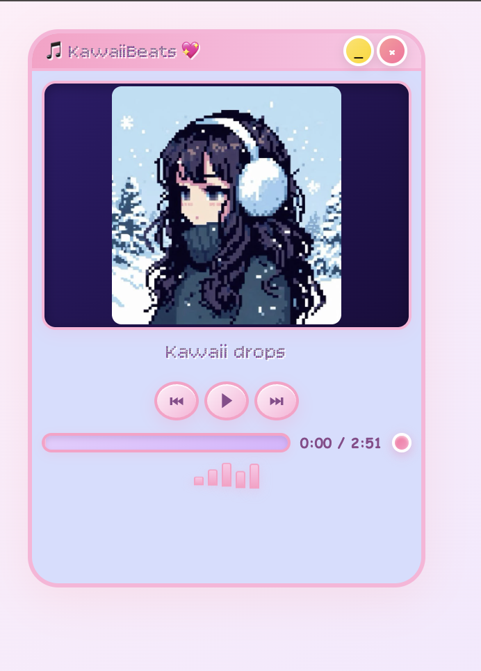
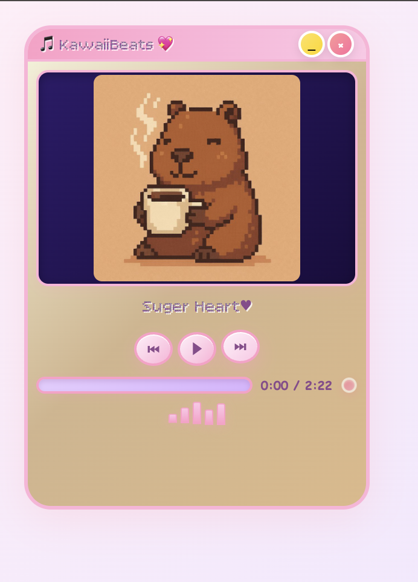
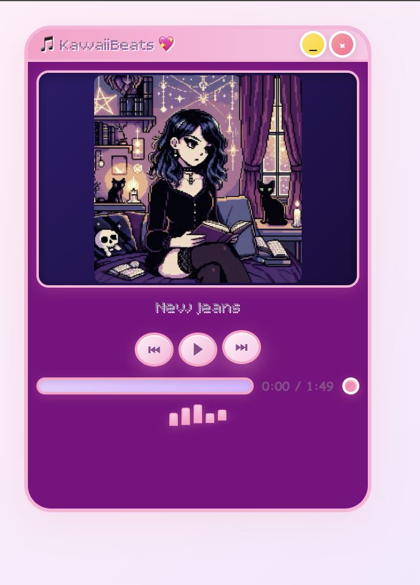

# 🎵 KawaiiBeats – Cute Aesthetic Music Player 💖

> Chill vibes. Soft aesthetics. Pure music. ✨

KawaiiBeats is a beautifully designed web-based music player with a cozy, kawaii-inspired interface. It delivers a smooth and calming listening experience with a visually pleasing UI.

---

## ✨ Features

- 🎶 **Music Player Controls**
  - Play / Pause
  - Next / Previous track
  - Smooth playback experience

- 📀 **Multiple Tracks**
  - 7 built-in songs 🎧  
  - Easy to extend with more tracks

- 📊 **Progress Bar**
  - Real-time song progress  
  - Track duration display  

- 🎚️ **Visualizer UI**
  - Animated bars reacting to music vibe  

- 🎨 **Dynamic Themes**
  - Different color palettes per song 💜💛💙  
  - Cute pixel-style album art  

- 🧸 **Aesthetic Design**
  - Soft pastel colors  
  - Kawaii UI elements  
  - Cozy, relaxing vibe  

---

## 🎯 Highlights

- ⚡ Lightweight & fast  
- 💖 Unique themed UI (not basic player)  
- 🎧 Smooth user experience  
- 🎨 Strong focus on design + emotion  

---

## 🖥️ Screenshots

### Cool Theme


### Warm Theme


### Purple Theme


---

## 🛠️ Tech Stack

- **Frontend:** HTML, CSS, JavaScript  
- **Audio Handling:** JavaScript Audio API  
- **Design:** Kawaii + Pixel Aesthetic  

---

## ⚙️ How to Run

```bash
# Clone repository
git clone https://github.com/Aakira14/kawaiibeats.git

# Open folder
cd kawaiibeats

# Run project
Open index.html in your browser
